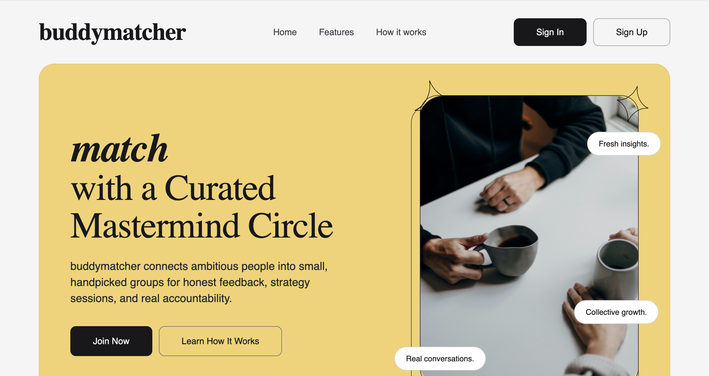
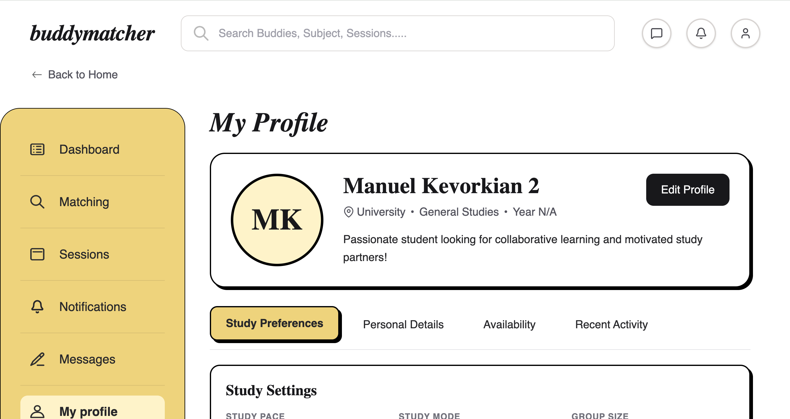

# 📚 Real-Time Study Buddy Matcher

> A full-stack, microservices-based platform that helps students find compatible study partners and groups based on shared academic interests, availability, and study preferences — with real-time event-driven communication via Kafka.

<p align="center"></p>

<table>
  
   <tr>
    <td></td>
    <td></td>
   </tr>
   

   
</table>
---

## 📑 Table of Contents

1. [Project Overview](#1-project-overview)
2. [Architecture Overview](#2-architecture-overview)
3. [Technology Stack](#3-technology-stack)
4. [System Flow — End to End](#4-system-flow--end-to-end)
5. [Microservices — Detailed Breakdown](#5-microservices--detailed-breakdown)
   - [User & Auth Service](#51-user--auth-service-port-4001)
   - [Profile & Preferences Service](#52-profile--preferences-service-port-4002)
   - [Availability Service](#53-availability-service-port-4003)
   - [Matching Service](#54-matching-service-port-4004)
   - [Study Session Service](#55-study-session-service-port-4005)
   - [Notification Service](#56-notification-service-port-4006)
   - [Messaging Service (Bonus)](#57-messaging-service-bonus-port-4007)
6. [GraphQL Gateway](#6-graphql-gateway-port-4000)
7. [Kafka Event Bus](#7-kafka-event-bus)
8. [Database Design (NeonDB + Prisma)](#8-database-design-neondb--prisma)
9. [Frontend (React + Apollo)](#9-frontend-react--apollo)
10. [Project Structure](#10-project-structure)
11. [Functional Requirements Mapping](#11-functional-requirements-mapping)
12. [Non-Functional Requirements](#12-non-functional-requirements)
13. [Milestones](#13-milestones)
14. [Setup & Running Locally](#14-setup--running-locally)
15. [Docker & Deployment](#15-docker--deployment)
16. [Team](#16-team)

---

## 1. Project Overview

Many students struggle to find peers who match their learning pace, schedule, and study style. The **Real-Time Study Buddy Matcher** solves this by:

- Allowing students to register, build an academic profile, and declare availability.
- Running a **compatibility-based matching algorithm** that scores potential study partners.
- Enabling students to **create, join, and manage study sessions** (online or in-person at university rooms).
- Delivering **real-time notifications** whenever a match is found, a session is created, or a buddy request is received.
- (Bonus) Providing an **in-platform chat** so matched students can coordinate without leaving the app.

---

## 2. Architecture Overview

```
      ┌─────────────────────────────────────────────────────────────────┐
      │                        React Frontend                           │
      │              (Apollo Client  ─  GraphQL over HTTP)              │
      └────────────────────────────┬────────────────────────────────────┘
                                   │  GraphQL queries / mutations
                                   ▼
┌───────────────────────────────────────────────────────────────────────────┐
│                    GraphQL Gateway  :4000                                 │
│          (Apollo Gateway — stitches all sub-graphs)                       │
└──┬──────────┬────────────┬──────────┬──────────┬───────────┬───────────┬──┘
   │          │            │          │          │           │           │
 :4001      :4002        :4003      :4004      :4005       :4006       :4007
 User       Profile      Avail.     Matching   Session     Notif.       Msg
Service     Service      Service    Service    Service    Service      Service
   │          │            │          │          │           │           │
   └──────────┴────────────┴──────────┴──────────┴───────────┴───────────┘
                                    │  Kafka (async events)
                                    ▼
                            ┌─────────────────┐
                            │  Apache Kafka   │
                            │  + Zookeeper    │
                            └─────────────────┘
```

Each microservice:
- Owns its **own NeonDB (PostgreSQL) database** — no shared databases.
- Communicates with other services **only through Kafka events** (no direct HTTP calls between services).
- Exposes its own **GraphQL sub-schema** consumed by the Gateway.
- Is packaged as an independent **Docker container**.

---

## 3. Technology Stack

| Layer | Technology |
|---|---|
| **Frontend** | React 18, Apollo Client, React Router v6, TailwindCSS |
| **API Gateway** | Apollo Gateway (GraphQL Federation) |
| **Backend Services** | Node.js 20, Apollo Server 4 |
| **ORM** | Prisma 5 |
| **Database** | NeonDB (Serverless PostgreSQL) — one DB per service |
| **Message Broker** | Apache Kafka + Zookeeper (via KafkaJS) |
| **Authentication** | JWT (jsonwebtoken) + bcryptjs for password hashing |
| **Containerization** | Docker + Docker Compose |
| **Deployment** | Render / Railway + Docker |

---

## 4. System Flow — End to End

Below is a step-by-step walkthrough of a complete user journey through the system.

### 4.1 Registration & Login

```
1. User opens the React app → Landing Page.
2. User clicks "Sign Up" → fills in name, email, password, university, academic year.
3. React sends a GraphQL `register` mutation → Gateway → User Service.
4. User Service:
   a. Checks email uniqueness in its PostgreSQL DB.
   b. Hashes the password with bcrypt.
   c. Creates the user record.
   d. Signs a JWT and returns { token, user }.
5. React stores the JWT in localStorage / context.
6. All subsequent GraphQL requests include the JWT in the Authorization header.
```

### 4.2 Building a Profile

```
7. User lands on "Profile Setup" page.
8. React sends `addCourse`, `addTopic`, `updatePreferences` mutations → Gateway → Profile Service.
9. Profile Service:
   a. Reads the JWT from context to identify the user.
   b. Creates/updates courses, topics, and preferences in its DB.
   c. Publishes a `UserPreferencesUpdated` Kafka event with the updated data.
10. Matching Service (Kafka consumer) receives `UserPreferencesUpdated`:
    a. Caches the new preference data for this user.
    b. Queues a re-match calculation for this user.
```

### 4.3 Setting Availability

```
11. User navigates to "Availability Management" page.
12. React sends `addAvailabilitySlot` mutations → Gateway → Availability Service.
13. Availability Service:
    a. Validates no overlapping slots for the same day.
    b. Saves the slot in its DB.
    c. Publishes an `AvailabilityUpdated` Kafka event.
14. Matching Service (Kafka consumer) receives `AvailabilityUpdated`:
    a. Updates its local copy of this user's time slots.
    b. Re-runs the compatibility scoring algorithm against all other users.
```

### 4.4 Matching Algorithm

```
15. Matching Service scores every other user against the requesting user using:

    Score = Σ weights:
      • Shared courses          → +20 pts each (max 40)
      • Shared topics           → +15 pts each (max 30)
      • Overlapping time slots  → +20 pts (at least 1 overlap)
      • Same study pace         → +10 pts
      • Same study mode         → +10 pts
      • Same study style        → +5 pts
      • Same group size pref    → +5 pts
    
    Total normalized to 100.

16. Top matches (score ≥ threshold) are stored in the Matching DB.
17. Matching Service publishes a `MatchFound` Kafka event for each new match.
18. Notification Service (Kafka consumer) receives `MatchFound`:
    a. Creates a Notification record in its DB for the matched user.
```

### 4.5 Viewing Matches & Sending Buddy Requests

```
19. User opens "Study Buddy Recommendations" page.
20. React sends `getMyMatches` query → Gateway → Matching Service.
21. User clicks "Send Buddy Request" → `sendBuddyRequest` mutation → Matching Service.
22. Matching Service:
    a. Records the request in DB.
    b. Publishes `BuddyRequestCreated` Kafka event.
23. Notification Service receives `BuddyRequestCreated`:
    a. Creates a notification for the target user.
```

### 4.6 Creating & Joining Study Sessions

```
24. User opens "Create Study Session" page.
25. React sends `createStudySession` mutation → Gateway → Session Service.
26. Session Service:
    a. Stores session (topic, date, time, duration, type, participants) in its DB.
    b. For in-person: records the requested university room.
    c. Publishes `StudySessionCreated` Kafka event.
27. Notification Service receives `StudySessionCreated`:
    a. Notifies all invited participants.
28. Another user sends `joinStudySession` mutation → Session Service:
    a. Adds user to participant list.
    b. Publishes `StudySessionJoined` event.
    c. Notification Service notifies the session creator.
```

### 4.7 Notifications

```
29. User opens "Notifications" page or dropdown.
30. React sends `getMyNotifications` query → Gateway → Notification Service.
31. User sends `markNotificationRead` mutation → Notification Service updates DB.
```

### 4.8 Messaging (Bonus)

```
32. Two matched users navigate to "Chat" page.
33. React sends `sendMessage` mutation → Gateway → Messaging Service.
34. Messaging Service stores message (senderId, receiverId, content, timestamp) in DB.
35. React polls or subscribes (GraphQL Subscription) for new messages using `getConversation`.
```

---

## 5. Microservices — Detailed Breakdown

### 5.1 User & Auth Service (Port: 4001)

**Responsibility:** Account creation, authentication, and basic profile data.

**Database models:**
| Field | Type | Notes |
|---|---|---|
| id | UUID | Primary key |
| name | String | |
| email | String | Unique |
| passwordHash | String | bcrypt hashed |
| university | String | Optional |
| academicYear | String | Optional |
| contactInfo | String | Phone/email for external comms |
| createdAt | DateTime | |

**GraphQL API:**
```graphql
# Queries
me: User
getUserById(id: ID!): User

# Mutations
register(name, email, password, university, academicYear, contactInfo): AuthPayload
login(email, password): AuthPayload
updateProfile(name, university, academicYear, contactInfo): User
```

**Kafka events produced:** None (auth is synchronous)

**Security:**
- Passwords hashed with `bcryptjs` (salt rounds: 10).
- JWT signed with `HS256`, expires in 7 days.
- All other services validate the same JWT secret in their context middleware.

---

### 5.2 Profile & Preferences Service (Port: 4002)

**Responsibility:** Academic courses, help topics, and study preference settings.

**Database models:**
- `Profile` — one per user (userId FK to user-service)
- `Course` — many per profile (name, code)
- `Topic` — many per profile (name)
- `Preferences` — one per profile (studyPace, studyMode, groupSize, studyStyle)

**GraphQL API:**
```graphql
# Queries
getMyProfile: Profile
getProfileByUserId(userId: ID!): Profile

# Mutations
upsertProfile(userId: ID!): Profile
addCourse(name, code): Course
removeCourse(courseId: ID!): Boolean
addTopic(name): Topic
removeTopic(topicId: ID!): Boolean
updatePreferences(studyPace, studyMode, groupSize, studyStyle): Preferences
```

**Kafka events produced:**
| Event | Trigger |
|---|---|
| `UserPreferencesUpdated` | Any course, topic, or preference change |

**Study Preferences enum values:**
- `studyPace`: `slow` | `moderate` | `fast`
- `studyMode`: `online` | `in-person` | `both`
- `groupSize`: `solo` | `small` | `large`
- `studyStyle`: `notes` | `listening` | `discussion` | `quiet` | `other`

---

### 5.3 Availability Service (Port: 4003)

**Responsibility:** Weekly recurring availability windows per user.

**Database models:**
- `AvailabilitySlot` — userId, dayOfWeek (0–6), startTime (HH:MM), endTime (HH:MM)
- Unique constraint: `[userId, dayOfWeek, startTime]`
- Overlap prevention enforced at the resolver level before DB insert.

**GraphQL API:**
```graphql
# Queries
getMyAvailability: [AvailabilitySlot!]!
getAvailabilityByUserId(userId: ID!): [AvailabilitySlot!]!

# Mutations
addAvailabilitySlot(dayOfWeek, startTime, endTime): AvailabilitySlot
updateAvailabilitySlot(id, startTime, endTime): AvailabilitySlot
deleteAvailabilitySlot(id): Boolean
```

**Kafka events produced:**
| Event | Trigger |
|---|---|
| `AvailabilityUpdated` | Slot created, updated, or deleted |

**Overlap Detection Logic:**
Two time slots on the same day overlap if:
`newStart < existingEnd AND newEnd > existingStart`
Times are converted to minutes-since-midnight for comparison.

---

### 5.4 Matching Service (Port: 4004)

**Responsibility:** Calculate compatibility scores and generate study buddy recommendations.

**Database models:**
- `UserSnapshot` — local cache of user's courses, topics, preferences, availability (kept fresh by Kafka)
- `Match` — userId, matchedUserId, score (0–100), reasons (JSON array), status (pending/accepted/rejected)

**GraphQL API:**
```graphql
# Queries
getMyMatches: [Match!]!
getMatchById(id: ID!): Match

# Mutations
triggerMatching: [Match!]!
sendBuddyRequest(matchedUserId: ID!): Match
respondToBuddyRequest(matchId: ID!, accept: Boolean!): Match
```

**Kafka events consumed:**
| Event | Action |
|---|---|
| `UserPreferencesUpdated` | Update UserSnapshot, re-run matching |
| `AvailabilityUpdated` | Update UserSnapshot, re-run matching |

**Kafka events produced:**
| Event | Trigger |
|---|---|
| `MatchFound` | New high-score match identified |
| `BuddyRequestCreated` | User sends a buddy request |

**Scoring Algorithm:**
```
score = 0

for each shared course:       score += 20   (cap at 40)
for each shared topic:        score += 15   (cap at 30)
if overlapping availability:  score += 20
if same studyPace:            score += 10
if same studyMode:            score += 10
if same studyStyle:           score +=  5
if same groupSize:            score +=  5

score = min(score, 100)
```
Matches with `score >= 40` are surfaced as recommendations, sorted descending.

**Match explanation reasons** (examples):
- `"Shared course: CS301"`
- `"Overlapping availability: Monday 14:00–16:00"`
- `"Same study style: discussion"`

---

### 5.5 Study Session Service (Port: 4005)

**Responsibility:** Create, join, cancel, and manage study sessions.

**Database models:**
- `StudySession` — id, creatorId, topic, date, time, duration (minutes), sessionType (online/in-person), roomId (optional), contactInfo, status
- `SessionParticipant` — sessionId, userId, joinedAt

**GraphQL API:**
```graphql
# Queries
getMySessions: [StudySession!]!
getSessionById(id: ID!): StudySession
getOpenSessions: [StudySession!]!

# Mutations
createStudySession(topic, date, time, duration, sessionType, roomId, participantIds): StudySession
joinStudySession(sessionId: ID!): SessionParticipant
leaveStudySession(sessionId: ID!): Boolean
cancelStudySession(sessionId: ID!): Boolean
```

**Kafka events produced:**
| Event | Trigger |
|---|---|
| `StudySessionCreated` | New session created |
| `StudySessionJoined` | User joins a session |
| `StudySessionCancelled` | Session cancelled |

**Session types:**
- `online` — session held via video call; contact info (link/email) stored.
- `in-person` — session held at a university study room; `roomId` is stored for reservation tracking.

---

### 5.6 Notification Service (Port: 4006)

**Responsibility:** Create and serve user notifications triggered by system events.

**Database models:**
- `Notification` — id, userId, type, message, isRead, createdAt, metadata (JSON)

**Notification types:**
| Type | Trigger event |
|---|---|
| `MATCH_FOUND` | `MatchFound` Kafka event |
| `BUDDY_REQUEST_RECEIVED` | `BuddyRequestCreated` Kafka event |
| `SESSION_CREATED` | `StudySessionCreated` Kafka event |
| `SESSION_JOINED` | `StudySessionJoined` Kafka event |
| `SESSION_CANCELLED` | `StudySessionCancelled` Kafka event |

**GraphQL API:**
```graphql
# Queries
getMyNotifications: [Notification!]!
getUnreadCount: Int!

# Mutations
markNotificationRead(id: ID!): Notification
markAllRead: Boolean
```

**Kafka events consumed:**
`MatchFound`, `BuddyRequestCreated`, `StudySessionCreated`, `StudySessionJoined`, `StudySessionCancelled`

---

### 5.7 Messaging Service — Bonus (Port: 4007)

**Responsibility:** In-platform chat between matched users.

**Database models:**
- `Conversation` — id, participantIds (array), createdAt
- `Message` — id, conversationId, senderId, content, createdAt

**GraphQL API:**
```graphql
# Queries
getConversation(withUserId: ID!): Conversation
getMessages(conversationId: ID!, limit: Int, offset: Int): [Message!]!

# Mutations
sendMessage(receiverId: ID!, content: String!): Message
```

**Note:** If this service is not implemented, session contact info (email/phone) is surfaced directly in the `StudySession` and `Match` GraphQL types so users can communicate externally.

---

## 6. GraphQL Gateway (Port: 4000)

The **Apollo Gateway** stitches all seven sub-schemas into a single unified GraphQL API that the React frontend communicates with.

```
Frontend  →  POST http://localhost:4000/graphql
                     │
          Apollo Gateway (schema stitching)
                     │
     ┌───────────────┼───────────────────┐
   :4001           :4002               :4003 ...
```

**How it works:**
- Each service exposes its own standalone Apollo Server.
- The Gateway uses `@apollo/gateway` to introspect each service's schema and merge them.
- The frontend only needs to know the Gateway URL — never individual service URLs.
- The JWT from the client is forwarded as-is in the `Authorization` header to each downstream service.

---

## 7. Kafka Event Bus

Kafka acts as the **central nervous system** of the platform. Services never call each other directly over HTTP.

### Topics & Producers/Consumers

| Kafka Topic | Producer | Consumers |
|---|---|---|
| `UserPreferencesUpdated` | Profile Service | Matching Service |
| `AvailabilityUpdated` | Availability Service | Matching Service |
| `MatchFound` | Matching Service | Notification Service |
| `BuddyRequestCreated` | Matching Service | Notification Service |
| `StudySessionCreated` | Session Service | Notification Service |
| `StudySessionJoined` | Session Service | Notification Service |
| `StudySessionCancelled` | Session Service | Notification Service |

### Event Message Schema

Every Kafka message follows this envelope:
```json
{
  "event": "MatchFound",
  "timestamp": "2026-03-10T14:30:00.000Z",
  "producer": "matching-service",
  "correlationId": "550e8400-e29b-41d4-a716-446655440000",
  "payload": {
    "userId": "abc123",
    "matchedUserId": "def456",
    "score": 75,
    "reasons": ["Shared course: CS301", "Same study style: discussion"]
  }
}
```

**Fields explained:**
- `event` — name of the event type.
- `timestamp` — ISO-8601 UTC time of event emission.
- `producer` — name of the emitting service (for tracing/debugging).
- `correlationId` — UUID for distributed tracing.
- `payload` — event-specific data.

---

## 8. Database Design (NeonDB + Prisma)

Each service has its **own isolated NeonDB database**. Services are not allowed to query another service's DB — cross-service data is exchanged only through Kafka.

| Service | Database Name | Key Tables |
|---|---|---|
| User Service | `user_service_db` | `User` |
| Profile Service | `profile_service_db` | `Profile`, `Course`, `Topic`, `Preferences` |
| Availability Service | `availability_service_db` | `AvailabilitySlot` |
| Matching Service | `matching_service_db` | `UserSnapshot`, `Match` |
| Session Service | `session_service_db` | `StudySession`, `SessionParticipant` |
| Notification Service | `notification_service_db` | `Notification` |
| Messaging Service | `messaging_service_db` | `Conversation`, `Message` |

**Prisma** is used in every service as the ORM. Each service runs `prisma migrate dev` independently against its own `DATABASE_URL`.

---

## 9. Frontend (React + Apollo)

### Pages & Routing

| Route | Page | Key Features |
|---|---|---|
| `/` | Landing Page | Hero, features overview, sign up / login CTA |
| `/register` | Registration | Name, email, password, university, academic year |
| `/login` | Login | Email + password, JWT stored in context |
| `/profile/setup` | Profile Setup | Add courses, topics, academic year |
| `/preferences` | Study Preferences | Pace, mode, group size, style |
| `/availability` | Availability | Weekly calendar slots, add/edit/delete |
| `/dashboard` | Dashboard | Summary cards: matches, upcoming sessions, notifications |
| `/matches` | Matching Page | List of recommended buddies with scores |
| `/matches/:id` | Match Details | Shared courses, preferences, overlapping times |
| `/connections` | Buddy Connections | Incoming/outgoing requests, accepted partners |
| `/sessions` | Study Sessions | Upcoming & past sessions |
| `/sessions/create` | Create Session | Topic, date, time, duration, type, room, participants |
| `/notifications` | Notifications | List with read/unread status |
| `/chat` | Messaging (Bonus) | Conversation list, real-time messages |
| `/profile` | User Profile | Edit info, view activity history |

### State Management

- **Apollo Client cache** handles server state (queries & mutations).
- **React Context** (`AuthContext`) holds the JWT token and current user object.
- **Custom hooks** (`useAuth`, `useNotifications`, `useMatches`) abstract GraphQL calls.

### GraphQL Client Setup

```js
// src/graphql/apolloClient.js
import { ApolloClient, InMemoryCache, createHttpLink } from '@apollo/client';
import { setContext } from '@apollo/client/link/context';

const httpLink = createHttpLink({ uri: 'http://localhost:4000/graphql' });

const authLink = setContext((_, { headers }) => {
  const token = localStorage.getItem('token');
  return {
    headers: { ...headers, authorization: token ? `Bearer ${token}` : '' }
  };
});

export const client = new ApolloClient({
  link: authLink.concat(httpLink),
  cache: new InMemoryCache()
});
```

---

## 10. Project Structure

```
software_proj/
├── services/
│   ├── user-service/
│   │   ├── prisma/schema.prisma
│   │   ├── src/
│   │   │   ├── index.js               ← Apollo Server entry
│   │   │   ├── schema/typeDefs.js     ← GraphQL type definitions
│   │   │   ├── resolvers/index.js     ← Query & Mutation resolvers
│   │   │   ├── middleware/auth.js     ← JWT sign/verify
│   │   │   └── utils/
│   │   ├── package.json
│   │   └── .env.example
│   │
│   ├── profile-service/
│   │   ├── prisma/schema.prisma
│   │   ├── src/
│   │   │   ├── index.js
│   │   │   ├── schema/typeDefs.js
│   │   │   ├── resolvers/index.js
│   │   │   └── kafka/producer.js      ← Publishes UserPreferencesUpdated
│   │   └── package.json
│   │
│   ├── availability-service/
│   │   ├── prisma/schema.prisma
│   │   ├── src/
│   │   │   ├── index.js
│   │   │   ├── schema/typeDefs.js
│   │   │   ├── resolvers/index.js     ← Overlap detection logic
│   │   │   └── kafka/producer.js      ← Publishes AvailabilityUpdated
│   │   └── package.json
│   │
│   ├── matching-service/
│   │   ├── prisma/schema.prisma
│   │   ├── src/
│   │   │   ├── index.js
│   │   │   ├── schema/typeDefs.js
│   │   │   ├── resolvers/index.js
│   │   │   ├── kafka/consumer.js      ← Listens to Prefs + Availability events
│   │   │   ├── kafka/producer.js      ← Publishes MatchFound, BuddyRequestCreated
│   │   │   └── utils/scoring.js       ← Compatibility scoring algorithm
│   │   └── package.json
│   │
│   ├── session-service/
│   │   ├── prisma/schema.prisma
│   │   ├── src/
│   │   │   ├── index.js
│   │   │   ├── schema/typeDefs.js
│   │   │   ├── resolvers/index.js
│   │   │   └── kafka/producer.js      ← Publishes Session events
│   │   └── package.json
│   │
│   ├── notification-service/
│   │   ├── prisma/schema.prisma
│   │   ├── src/
│   │   │   ├── index.js
│   │   │   ├── schema/typeDefs.js
│   │   │   ├── resolvers/index.js
│   │   │   └── kafka/consumer.js      ← Listens to all notification-triggering events
│   │   └── package.json
│   │
│   └── messaging-service/             ← Bonus
│       ├── prisma/schema.prisma
│       ├── src/
│       │   ├── index.js
│       │   ├── schema/typeDefs.js
│       │   └── resolvers/index.js
│       └── package.json
│
├── gateway/
│   ├── src/
│   │   └── index.js                   ← Apollo Gateway entry
│   └── package.json
│
├── frontend/
│   ├── public/
│   ├── src/
│   │   ├── components/
│   │   │   ├── auth/                  ← LoginForm, RegisterForm
│   │   │   ├── profile/               ← CourseList, PreferencesForm
│   │   │   ├── matching/              ← BuddyCard, MatchDetails
│   │   │   ├── sessions/              ← SessionCard, CreateSessionForm
│   │   │   ├── notifications/         ← NotificationBell, NotificationList
│   │   │   ├── messaging/             ← ChatWindow, MessageBubble
│   │   │   └── layout/               ← Navbar, Sidebar, Footer
│   │   ├── pages/                     ← One file per route
│   │   ├── graphql/
│   │   │   ├── queries/               ← All GQL query strings
│   │   │   └── mutations/             ← All GQL mutation strings
│   │   ├── context/AuthContext.jsx    ← JWT + user state
│   │   ├── hooks/                     ← useAuth, useMatches, etc.
│   │   ├── utils/
│   │   ├── App.jsx                    ← Routes
│   │   └── main.jsx                   ← Apollo Provider entry
│   └── package.json
│
├── shared/                            ← Shared constants (Kafka topic names, etc.)
│
├── docker/
│   └── (per-service Dockerfiles)
│
├── docker-compose.yml                 ← Full stack orchestration
└── README.md
```

---

## 11. Functional Requirements Mapping

| Requirement | Implemented By |
|---|---|
| Register / Login with JWT | User Service |
| Retrieve & update profile | User Service |
| Add/remove courses & topics | Profile Service |
| Update study preferences | Profile Service |
| Add/update/delete availability slots | Availability Service |
| Prevent overlapping availability | Availability Service (resolver logic) |
| Generate compatibility-scored matches | Matching Service |
| View recommended study partners | Matching Service |
| Send/respond to buddy requests | Matching Service |
| Create study sessions (online & in-person) | Session Service |
| Join / leave / cancel sessions | Session Service |
| Notify on match, request, session events | Notification Service |
| Mark notifications as read | Notification Service |
| Send messages between matched users | Messaging Service (Bonus) |
| View conversation history | Messaging Service (Bonus) |
| Async inter-service communication | Kafka |
| Unified API for frontend | GraphQL Gateway |
| Secure password storage | bcryptjs in User Service |
| Per-user data isolation | JWT context in every service |

---

## 12. Non-Functional Requirements

| NFR | Implementation |
|---|---|
| Passwords securely hashed | bcrypt with 10 salt rounds |
| JWT protects all GraphQL APIs | Middleware in every service context |
| Preference updates < 2 seconds | Lightweight Prisma upserts; Kafka async (non-blocking) |
| Matching results < 3 seconds | In-memory scoring on cached snapshots |
| No overlapping availability | Checked in-code before DB write |
| Data privacy | Users can only modify their own data (userId check in resolvers) |
| Scalability | Each service deployable independently; Kafka consumer groups handle load |
| Data accuracy for time slots | HH:MM strings stored consistently; overlap detection in minutes |

---

## 13. Milestones

### Milestone 1 — UI/UX Design in Figma (30%) · Deadline: 17/3/2026

Design a complete, interactive Figma prototype covering:
- Landing page, registration & login
- Profile setup & study preferences
- Availability management
- Dashboard
- Matching & match details
- Buddy requests & connections
- Study sessions (list + create)
- Notifications
- Messaging / chat (optional)
- User profile & activity page

Deliverable: Figma file link + a document explaining the UI/UX concepts applied per page.

---

### Milestone 2 — Backend Development & Service Integration (40%) · Deadline: 10/4/2026

Deliverables:
- All 6 (or 7 with bonus) microservices implemented and running.
- Each service has its own NeonDB schema migrated via Prisma.
- Kafka producers and consumers wired up and tested.
- GraphQL Gateway exposing a unified schema.
- `.env.example` per service with all required variables.

Evaluation: Live demo slot — reserve on first-come first-serve basis.

---

### Milestone 3 — Frontend Implementation & Deployment (30%) · Deadline: 12/5/2026

Deliverables:
- React app implementing all Figma designs.
- Apollo Client connected to the GraphQL Gateway.
- Docker Compose file running the entire stack.
- Services deployed on Render / Railway.

---

## 14. Setup & Running Locally

### Prerequisites

- Node.js 20+
- Docker Desktop
- A NeonDB project (free tier) with one database per service

### Steps

```bash
# 1. Clone the repository
git clone https://github.com/kevorkian-mano/software-proj_2.git
cd software-proj_2

# 2. Start Kafka & Zookeeper via Docker
docker-compose up -d zookeeper kafka

# 3. Bootstrap each service
for service in user-service profile-service availability-service matching-service session-service notification-service; do
  cd services/$service
  cp .env.example .env          # Fill in your NeonDB DATABASE_URL + JWT_SECRET
  npm install
  npx prisma migrate dev --name init
  npm run dev &
  cd ../..
done

# 4. Start the Gateway
cd gateway
cp .env.example .env
npm install
npm run dev &
cd ..

# 5. Start the Frontend
cd frontend
npm install
npm run dev
```

Open: `http://localhost:5173` (Vite) or `http://localhost:3000` (CRA)

---

## 15. Docker & Deployment

### Docker Compose Overview

`docker-compose.yml` spins up:
- `zookeeper` — Kafka coordination
- `kafka` — Message broker (Confluent / Bitnami image)
- `user-service` through `notification-service` — each with its own container
- `gateway` — Apollo Gateway container
- `frontend` — Nginx-served React build

```bash
# Build and run the full stack
docker-compose up --build

# Stop everything
docker-compose down
```

### Environment Variables Per Service

| Variable | Description |
|---|---|
| `DATABASE_URL` | NeonDB connection string |
| `JWT_SECRET` | Shared secret for JWT signing/verification |
| `KAFKA_BROKER` | Kafka broker address (e.g. `kafka:9092` inside Docker) |
| `PORT` | HTTP port the service listens on |

### Deployment on Render / Railway

1. Push each service folder as a separate Web Service.
2. Set environment variables via the platform dashboard.
3. Set `KAFKA_BROKER` to your hosted Kafka URL (e.g., Upstash Kafka).
4. Deploy the gateway and frontend last, after all services are live.

---

## 16. Team

This project is developed by a team of 5 members as part of the course requirements.

| # | Role |
|---|---|
| 1 | Team Lead / Matching Service |
| 2 | User & Auth Service + Gateway |
| 3 | Profile & Availability Services |
| 4 | Session & Notification Services |
| 5 | Frontend (React + Apollo) + Docker |

---

> **Note:** The Messaging / Chat Service is a **bonus feature**. Its absence must be compensated by exposing contact information (email/phone) directly in the `StudySession` and `Match` types so session participants can communicate externally.
